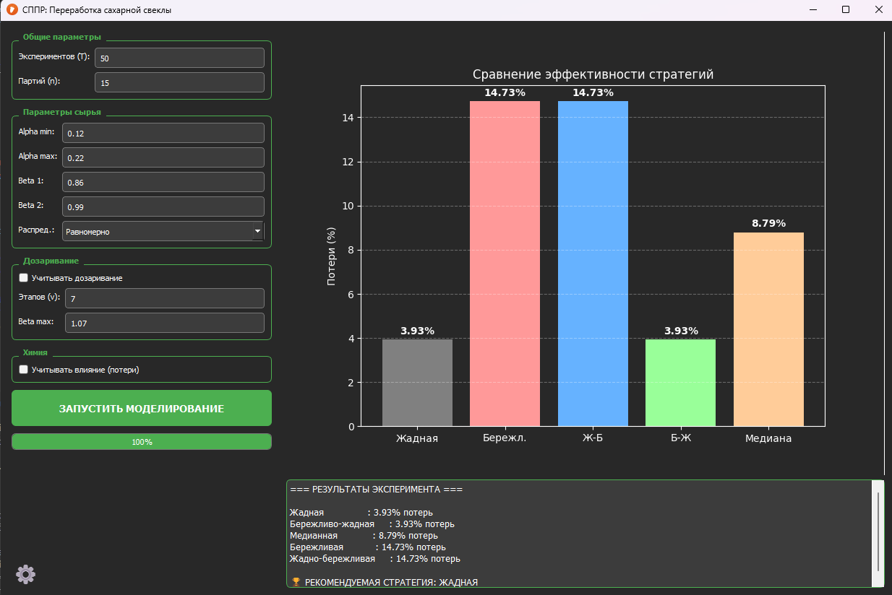

# 🍬 СППР «Переработка сахарной свеклы»


Система поддержки принятия решений (СППР) для агропромышленных предприятий. Программа моделирует процесс переработки партий сахарной свеклы, учитывает биологические и химические факторы (деградация сахара, дозаривание, примеси) и подбирает оптимальную стратегию переработки для максимизации прибыли.



---

## 🚀 Возможности

*   **Гибридное ядро:** Вычислительно сложные алгоритмы реализованы на **C++** для максимальной скорости, интерфейс — на **Python (PyQt5)**.
*   **Гибкая настройка:**
    *   Учет деградации сырья (равномерное и концентрированное распределение).
    *   Моделирование процесса дозаривания (рост сахаристости).
    *   Учет химических потерь (K, Na, N).
*   **Сравнение стратегий:**
    *   `Greedy` (Жадная)
    *   `Thrifty` (Бережливая)
    *   `Median` (Медианная)
    *   Комбинированные (`Greedy-Thrifty`, `Thrifty-Greedy`)
    *   **Венгерский алгоритм** (для поиска математического эталона)
*   **Визуализация:** Наглядные графики потерь и текстовые рекомендации.
*   **История экспериментов:** Все результаты автоматически сохраняются в базу данных SQLite.
*   **Темная тема:** Современный интерфейс с поддержкой темной и светлой темы.

---

## 🛠️ Установка и запуск

### Вариант 1: Запуск готового EXE (Windows)
Просто скачайте файл `SugarBeet Optimizer.exe` из раздела [Releases](https://github.com/Lepsps/cm-lab-sugar-beet-processing/releases/tag/v1.0) и запустите его. Установка не требуется.

### Вариант 2: Запуск из исходного кода

Вам понадобятся:
*   Python 3.10+
*   Компилятор C++ (Visual Studio Build Tools для Windows или gcc для Linux)

1.  **Клонируйте репозиторий:**
    ```bash
    git clone https://github.com/your-username/sugar-beet-sppr.git
    cd sugar-beet-sppr
    ```

2.  **Установите зависимости:**
    ```bash
    pip install -r requirements.txt
    ```

3.  **Скомпилируйте C++ ядро:**
    ```bash
    python setup.py build_ext --inplace
    ```

4.  **Запустите приложение:**
    ```bash
    python main.py
    ```

---

## 🏗️ Сборка в EXE

Проект включает скрипт автоматической сборки, который компилирует C++ модуль, упаковывает ресурсы и создает один исполняемый файл.

```bash
python build.py
```
После завершения файл `SugarBeet Optimizer.exe` появится в корневой папке.

---

## 📂 Структура проекта

```text
.
├── core/                   # C++ ядро (backend)
│   ├── src/                # Исходный код (.cpp)
│   └── include/            # Заголовки (.h)
├── gui/                    # Графический интерфейс (frontend)
│   ├── main_window.py      # Главное окно
│   ├── worker.py           # Потоки вычислений
│   └── ...
├── data/                   # Работа с данными
│   └── database.py         # Логика SQLite
├── assets/                 # Иконки и ресурсы
├── tests/                  # Тесты (pytest)
├── main.py                 # Точка входа
├── build.py                # Скрипт сборки EXE
└── setup.py                # Конфигурация компиляции C++
```

---

## 🧪 Тестирование

Для запуска unit-тестов (проверка корректности алгоритмов и генератора матриц):

```bash
# Сначала скомпилируйте проект
python setup.py -q build_ext --inplace

# Запустите тесты
pytest tests/test_core_algorithms.py
```

---

## 📝 Лицензия

Этот проект распространяется под лицензией MIT. Подробности в файле `LICENSE`.

---
2025 г.